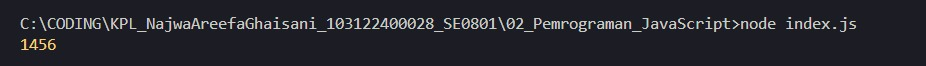

# Tugas Pendahuluan 02: Pemrograman JavaScript

**Output**

**Deskripsi Program**

 Jadi pokoknya program ini tu buat mengalikan semua bilangin positif yang ada di dalam array. Pokoknya dia tu bakalan ngecek bilangan tersebut satu per satu, kalau bilangan tersebut lebih dari 0 maka dia bakal dikaliin, kalau bilangannya 0 atau kurang dari 0 dia bakalan diskip (ga dikaliin). 

 Kaya misal yang ada didalam program tersebut kan ada [2, 0, 26, 28, -2]. Nah itu kan ada bilangan 0 dan -2, kedua bilangan tersebut nggak ikut dikalikan dengan bilangan 2, 26, 28 karena mereka berdua kurang dari 0. jadi hasilnya 1456.