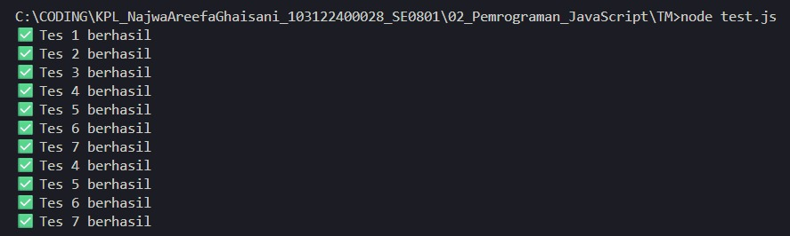

# Tugas Mandiri 02: Pemrograman JavaScript

**Output**

**Deskripsi Program**

 Jadi di file tm.js ini kita tu bakalan bikin fungsi buat menerima input larik (array) dan mengembalikan deretan bilangan dan "Fizz" untuk kelipatan 2, "Buzz" untuk kelipatan 7, dan "FizzBuzz" untuk kelipatan 14. 

 Lalu di tes menggunakan file test.js yang menampilkan hasil seperti gambar output diatas. 