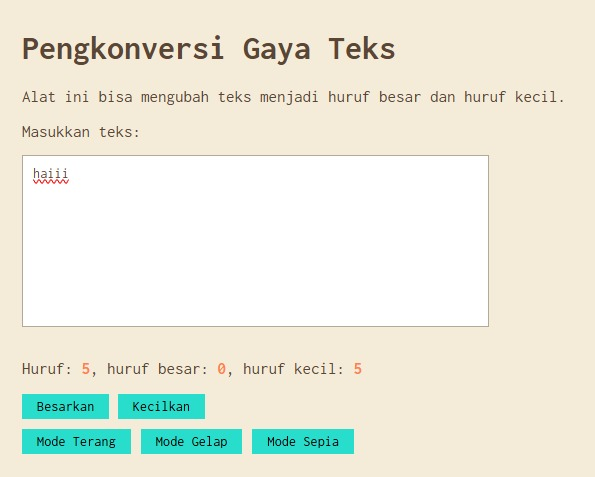

# Tugas Mandiri 04: Automata dan Table-Driven Construction

**Nama:** Najwa Areefa Ghaisani  
**NIM:** 103122400028  
**Kelas:** SE-08-01  

## Tugas
Tambahkan mode sepia dengan ketentuan:
| Elemen         | Warna     |
|----------------|-----------|
| Latar belakang | #F4ECD8 |
| Warna teks     | #5B4636 |

Biarkan form tetap warna putih.
Ketentuan lainnya:
1. Bagian mode-div harus menaungi tiga button: light, dark, dan sepia
2. Bisa berpindah state secara mulus: sepia menghasilkan sepia-mode, dark menghasilkan dark-mode, dan light menghasilkan light-mode

## Kode Sumber
Tersedia di [index.html](./index.html) [index.css](./index.css) dan [index.js](./index.js)

## Output

## Deskripsi Program

Program ini tu bakalan bisa menghitung jumlah huruf yang diketik secara real-time, dimana setiap karakter bakalan dicek satu per satu. Kalau karakternya huruf kapital akan dihitung sebagai huruf besar, kalau huruf kecil dihitung sebagai huruf kecil, dan keduanya dihitung ke total huruf keseluruhan. 

Selain itu, program ini juga juga punya tombol Besarkan untuk mengubah semua teks menjadi huruf kapital, dan tombol Kecilkan untuk mengubah semua teks menjadi huruf kecil. Program ini juga punya 3 mode yaitu light-mode, dark-mode, dan juga sepia-mode. 
