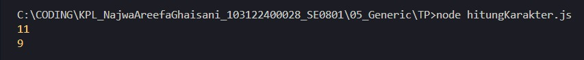

# Tugas Pendahuluan 05: Generic

**Nama:** Najwa Areefa Ghaisani  
**NIM:** 103122400028    
**Kelas:** SE-08-01  

## Tugas
Ini adalah kode yang mengurus jumlah semua karakter dan jumlah huruf:

```javascript
const str = "Bar bar";

let jumlahSemua = 0;
for (const c of str) { 
    jumlahSemua++; 
}
console.log(total);

let jumlahHuruf = 0;
for (const c of str) { 
    if (c === ' ') continue;
    jumlahHuruf++;
}
console.log(letters);
```
Bagaimana caramu hanya dengan satu fungsi generik bisa mengurus keduanya?

Agar fungsi yang kamu kerjakan benar atau tidak, berikut ini adalah kode tes yang bisa kamu tempelkan:
```javascript
const str = "Bar bar bar";
...
console.log(
   hitung(str, "semua") // Harusnya 11
);

console.log(
  hitung(str, "huruf") // Harusnya 9
);

hitung(str, "huruf"); // Tidak terjadi apa-apa
```

## Kode Sumber
Tersedia di [hitungKarakter.js](./hitungKarakter.js) 

## Output



## Deskripsi Program
Jadi di sini kita kan udah disediaiin yang awalnya kita dikasih 2 blok kode yang terpisah, yang satu buat ngitung semua karakter, yang satu lagi buat ngitung huruf aja (kalau ada spasi bakalan diskip). Nah terus kita disuruh, gimana caranya dua kode yang terpisah itu bisa digabung jadi satu fungsi aja yang bisa handle keduanya.

Nah kita bikinlah pakai Generic supaya satu fungsi bisa ada 2 kegunaan. Pertama kita siapin dulu total yang isinya 0, ini nanti buat nampung hasil hitungannya.
Abis itu kita muter satu-satu, kita cek tiap karakter yang ada di str pakai for. Nah di sinilah mode mulai berperan, kalau modenya "huruf", tiap ketemu spasi bakalan langsung diskip, yang dihitung cuma hurufnya aja. Tapi kalau modenya "semua", semua karakter bakalan dihitung tanpa terkecuali, spasi juga ikut dihitung.
Setelah semua karakter selesai dicek, hasilnya bakal dikembaliin lewat return total.
