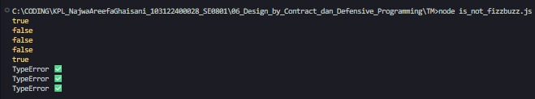

# Tugas Mandiri 06: Design by Contract dan Defensive Programming

**Nama:** Najwa Areefa Ghaisani  
**NIM:** 103122400028    
**Kelas:** SE-08-01  

## Tugas
Lindungi kode ini dari bilangan-bilangan "fizz buzz"!

Tugasmu adalah membuat fungsi yang menolak bilangan-bilangan kelipatan 3, 5, atau 15, menerima bilangan-bilangan bukan "fizz buzz", dan melempar yang bukan bilangan bulat.
```
function is_not_fizzbuzz(number) {
  // TODO
}

console.log(is_not_fizzbuzz(1)) // true
console.log(is_not_fizzbuzz(3)) // false
console.log(is_not_fizzbuzz(5)) // false
console.log(is_not_fizzbuzz(30)) // false
console.log(is_not_fizzbuzz(7)) // true
console.log(is_not_fizzbuzz(null)) // Lempar TypeError
console.log(is_not_fizzbuzz(NaN)) // Lempar TypeError
console.log(is_not_fizzbuzz(Infinity)) // Lempar TypeError
```

## Kode Sumber
Tersedia di [is_not_fizzbuzz.js](./is_not_fizzbuzz.js) 

## Output



## Deskripsi Program
Fungsi `is_not_fizzbuzz` ini intinya buat nyaring angka, mana yang fizzbuzz mana yang bukan. Pertama, fungsinya ngecek dulu inputnya valid atau nggak. Kalau yang masuk bukan angka, atau angkanya aneh kayak `null`, `NaN`, sama `Infinity`, langsung dilempar `TypeError`. Ini bagian defensive programming-nya, biar program nggak crash gara-gara input yang nggak beres. Kalau inputnya lolos, baru dicek apakah angkanya kelipatan 15, 3, atau 5. Kalau iya, return `false` karena itu fizzbuzz. Kalau nggak ada yang cocok, return `true` karena bukan fizzbuzz.