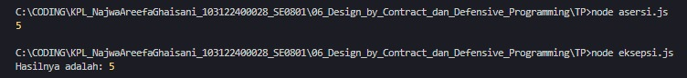

# Tugas Pendahuluan 06: Design by Contract dan Defensive Programming

**Nama:** Najwa Areefa Ghaisani  
**NIM:** 103122400028    
**Kelas:** SE-08-01  

## Tugas
Diberikan dua kode yang sama-sama melakukan operasi pembagian. Pertama menggunakan asersi, kedua menggunakan eksepsi.
```
const assert = require('assert');

function divide(a, b) {
  assert(typeof a === 'number' && typeof b === 'number', 'Nilai harus bilangan bulat');

  assert(b !== 0, 'Tidak bisa pembagian dengan nol');

  return a / b;
}

```
```
function divide(a, b) {
  if (typeof a !== "number" || typeof b !== "number") {
    throw new TypeError("Nilai harus bilangan bulat");
  }

  if (b === 0) {
    throw new Error("Tidak bisa pembagian dengan nol");
  }

  return a / b;
}

try {
  const result = divide(10, 2);
  console.log("Hasilnya adalah:", result);
} catch (error) {
  console.error("Error:", error);
}

```
Menurutmu, kapankah kita saatnya menggunakan asersi atau eksepsi untuk fungsi seperti ini di atas? Apakah kita harus sepenuhnya asersi, atau sepenuhnya eksepsi? Lakukan riset dan berikan jawabannya dalam bentuk esai minimal 300 kata.

## Kode Sumber
Tersedia di [asersi.js](./asersi.js) dan [eksepsi.js](./eksepsi.js)

## Output



## Deskripsi Program
Kalau menurutku, penggunaan asersi dan eksepsi itu sebenarnya nggak bisa dipilih salah satu. Banyak yang nganggep dua hal ini tu sama, padahal sebenarnya fungsinya beda banget. Justru yang paling bener itu dipakai barengan, tapi di konteks yang tepat.

Gampangnya gini, kita lihat dari “siapa yang salah”.
Kalau asersi, itu lebih kayak pengingat buat diri kita sendiri sebagai programmer. Asersi dipakai buat ngecek kondisi yang “harusnya nggak mungkin salah” kalau logika kode kita udah bener. Misalnya di fungsi divide(a, b), kita yakin banget bahwa input itu pasti angka dan b nggak mungkin nol, karena sebelumnya sudah difilter di bagian lain program. Nah, di situ asersi dipakai buat memastikan asumsi itu benar.

Kalau sampai asersi gagal, nya ada bug di kode kita sendiri. Jadi bukan salah user, tapi salah logika program yang kita bikin. Makanya asersi biasanya dipakai saat development atau testing, dan bahkan sering dimatikan di production biar performa lebih optimal.

Nah, beda lagi sama eksepsi. Eksepsi itu dipakai buat kondisi yang memang “sangat mungkin terjadi” di dunia nyata, terutama kalau program kita berinteraksi sama user, API, atau data dari luar. Misalnya user masukin string bukan angka, atau pembagi nol. Itu bukan bug, tapi memang kondisi yang harus kita handle.

Di sini kita pakai throw supaya error-nya bisa ditangkap pakai try...catch. Jadi program nggak langsung crash, tapi masih bisa dikontrol misalnya ngasih pesan error yang lebih bisa dimengerti oleh user. Intinya, eksepsi itu bikin aplikasi kita tetap stabil walaupun ada input yang aneh-aneh.

Jadi kesimpulannya, kita nggak harus sepenuhnya pakai asersi atau sepenuhnya eksepsi. Yang ideal itu kombinasi kayak, asersi dipakai buat ngecek asumsi internal (biar kita nggak bikin bug) dan eksepsi dipakai buat handle error dari luar (biar program tetap aman dan nggak crash)

Kalau diibaratkan, asersi itu buat developer biar nggak blunder, sedangkan eksepsi itu buat sistem biar tetap kuat menghadapi kondisi dunia nyata. Jadi, dua-duanya penting, tinggal kita pintar-pintar pakai di tempat yang pas.
itu tanda