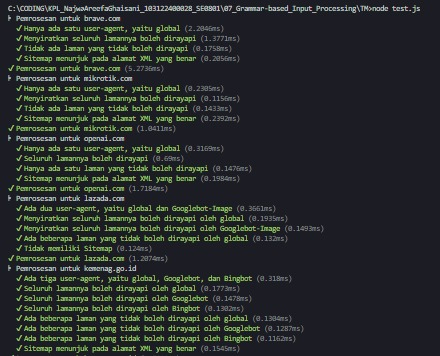
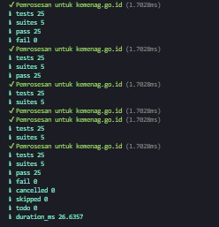

# Tugas Mandiri 07: Grammar-based input processing

**Nama:** Najwa Areefa Ghaisani  
**NIM:** 103122400028    
**Kelas:** SE-08-01  

## Tugas
Uraikan robot!

Tugas pada kesempatan kali ini adalah membuat fungsi yang menguraikan isi robots.txt menjadi POJO (plain old JavaScript object). Empat properti yang perlu diuraikan dijabarkan di bawah berikut.

User-agent adalah nama robot perayapnya
Allow adalah daftar halaman-halaman yang boleh dirayap
Disallow adalah daftar halaman-halaman yang tidak boleh dirayap
Sitemap adalah sebuah pranala yang menunjuk pada "denah" situs web (biasanya berformat XML)
Kamu akan mengerjakannya di dalam sebuah fungsi bernama parseRobots di index.js dan. Buka direktori 07 di sini untuk mengunduh berkas yang dimaksud, berkas-berikas robots.txt di dalam direktori daftar, dan berkas pengujiannya yaitu test.js.

Jadi, strukturnya harus seperti ini:
```
|   index.js
|   structure.d.ts // Opsional mau ada atau tidak
|   test.js
\---daftar
        brave.txt
        kemenag.txt
        lazada.txt
        mikrotik.txt
        nikkei.txt
        openai.txt
```
Agar kode yang kamu tulis di index.js bekerja atau tidak, jalankan test.js. Jika kamu membuat proyek Node (yang ada package.json), pastikan untuk membuat impor menjadi CommonJS dengan type: commonjs.

Beberapa petunjuk:
1. Manajemen state akan membantu
2. Nilai tambah jika kamu bisa mendeskripsikannya secara code tracing
3. Tidak perlu program untuk membaca TXT, itu sudah dilakukan oleh test.js
4. Hubungi asprak jika ada kendala atau kesalahan

## Kode Sumber
Tersedia di [index.js](./index.js) [structure.d.ts](./structure.d.ts) dan [test.js](./test.js)

## Output




## Deskripsi Program
Jadi parseRobots ini fungsinya buat nge-parse file robots.txt,file ini biasa dipake website buat ngasih tau crawler/bot mana aja halaman yang boleh atau nggak boleh dibaca. Cara kerjanya simpel tapi rapi. Teks mentahnya dipotong-potong dulu per baris, terus tiap baris dibersiin dari komentar (mereka diawali sama #) sama whitespace-nya. Kalau Baris kosong kita Skip aja.

Nah baris yang valid dipecah jadi pasangan key-value berdasarkan titik dua pertama yang ketemu. Dari situ, fungsi ini cuma ngenali empat key yang pertama user-agent buat nyimpen nama bot yang lagi aktif (disimpennya lowercase biar nggak ribet waktu dicek), yang kedua allow sama disallow buat nyimpen path yang boleh atau nggak boleh dirayapi ke array milik bot yang lagi aktif itu, dan sitemap buat ngumpulin URL-URL sitemapnya. Kalau ketemu key lain yang nggak dikenal, ya udah diabaikan aja, nggak ada drama.

Outputnya objek dengan dua properti: agents yang isinya pemetaan nama bot ke daftar path-nya, sama Sitemap buat daftar URL sitemap. Dan hasilnya? 25 dari 25 test case lulus semua — dari yang simpel kayak brave.com yang isinya hampir kosong, sampai yang lumayan kompleks kayak kemenag.go.id yang punya tiga bot berbeda (global, Googlebot, Bingbot) dengan aturan masing-masing.