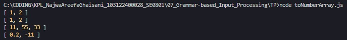

# Tugas Pendahuluan 07: Grammar-based Input Processing

**Nama:** Najwa Areefa Ghaisani  
**NIM:** 103122400028    
**Kelas:** SE-08-01  

## Tugas
Buatlah fungsi yang mengubah deretan angka bertipe string menjadi larik angka.

## Kode Sumber
Tersedia di [toNumberArray.js](./toNumberArray.js)

## Output

## Deskripsi Program
Fungsi `toNumberArray` ini tugasnya ngubah input jadi array angka, apapun bentuk inputnya. Pertama, fungsinya ngecek dulu inputnya array atau string. Kalau udah array langsung dipakai, kalau masih string dipecah dulu pakai `split(",")` biar jadi array. Habis itu tiap elemennya diproses, dibersihkan spasi-nya pakai `trim()`, terus diubah jadi angka pakai `parseFloat()`. Yang gagal diubah jadi angka kayak `"abc23"` langsung dibuang pakai `filter()`, jadi outputnya bersih cuma angka-angka yang valid aja.