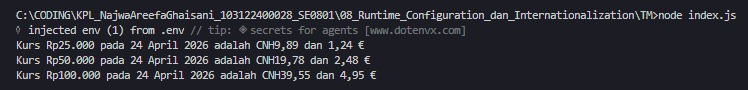

# Tugas Mandiri 08: Runtime Congfiguration dan Internationaliztion

**Nama:** Najwa Areefa Ghaisani  
**NIM:** 103122400028    
**Kelas:** SE-08-01  

## Tugas
Waktunya menukar uang!

Pada tugas ini kamu akan membuat program yang menampilkan kurs rupiah (IDR) terhadap renminbi luar Tiongkok (CNH) dan euro (EUR). Gunakan [link API ini](./https://cdn.jsdelivr.net/npm/@fawazahmed0/currency-api@latest/v1/currencies/idr.json) untuk mengambil data.

Tantangan

1. Simpanlah URL API ke dalam `.env` sebagai `BASE_API`
2. Gunakan `Intl` untuk memformat nilai mata uang dan waktu kamu mengambil data kurs.
3. Hapus pesan promosi `dotenv`

Ujilah dengan Rp25000, Rp50000, dan Rp100000.

## Kode Sumber
Tersedia di [index.js](./index.js)

## Output

## Deskripsi Program
Program ini tuh dipakai buat ambil data kurs mata uang dari API, terus dipakai buat ngitung konversi dari Rupiah ke CNH sama Euro. Awalnya dia nge-load `dotenv` biar bisa baca link API dari file `.env`, terus ada fungsi `ambilData(angka)` yang bakal nge-fetch data dari API. Kalau datanya berhasil diambil, langsung diubah ke JSON, terus diambil deh nilai kurs sama tanggalnya. Nah, tanggal itu juga diformat pakai `Intl.DateTimeFormat` biar tampil pakai format Indonesia, jadi lebih enak dibaca.

Setelah itu, angka Rupiah yang dimasukin diformat jadi “Rp” biar keliatan rapi, terus dihitung konversinya ke CNH sama EUR. Hasilnya dibuletin jadi dua angka di belakang koma, terus ditampilin pakai `console.log` dalam bentuk kalimat. Di bagian akhir, ada beberapa contoh angka yang langsung diuji satu per satu, jadi programnya bisa langsung nampilin beberapa hasil konversi sekaligus tanpa harus dipanggil manual satu-satu.