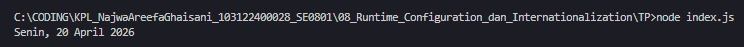

# Tugas Pendahuluan 08: Runtime Configuration dan Internatonalization

**Nama:** Najwa Areefa Ghaisani  
**NIM:** 103122400028    
**Kelas:** SE-08-01  

## Tugas
Tampilkan tanggal sekarang dengan format seperti ini:
```
Sabtu, 18 April 2026
```

Nilai waktu tidak harus sama, asalkan formatnya benar dan bisa tampil di komputer terpisah pada waktu tertentu. Gunakan ```Intl.DateTimeFormat``` (bukan string manual).

## Kode Sumber
Tersedia di [index.js](./index.js)

## Output



## Deskripsi Program
Program ini buat nampilin tanggal hari ini pakai JavaScript. Pokoknya dia tu ngambil tanggal sekarang dari komputer lewat new Date(), terus diformat dulu pakai Intl.DateTimeFormat sebelum ditampilin. Nah di Intl.DateTimeFormat-nya dikasih tau dua hal yang pertama lokalnya 'id-ID' biar outputnya bahasa Indonesia, yang kedua sama opsi formatnya yang minta tampil nama hari panjang, tanggal, nama bulan panjang, sama tahun. Hasilnya langsung di-console.log dan keluar deh tulisan kayak "Senin, 20 April 2026" jadi bukan ditulis manual, tapi bakalan otomatis ngikutin tanggal waktu programnya dijalanin.