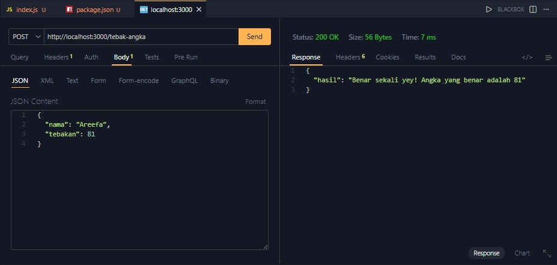

# Tugas Pendahuluan 09: API Design dan Construction Using Swagger  

**Nama:** Najwa Areefa Ghaisani  
**NIM:** 103122400028    
**Kelas:** SE-08-01  

## Tugas
Mari kita main tebak-tebakan angka acak!

Tugasmu adalah membuat API yang terdiri dari satu endpoint saja, yaitu POST /. Ketika kita melakkukan POST, formatnya adalah seperti yang sudah diberikan.

Beberapa aturan:

1. Angka acak yang dihasilkan harus tetap dan tidak boleh berubah setiap kali permintaan API dilakukan, tetapi boleh berubah setiap harinya atau dibuat tetap selamanya
2. Rentang harus di antara 1-100
3. Nama harus sensitif terhadap besar kecil huruf (mis. hamid dan Hamid akan menghasilkan angka acak yang berbeda)
4. Tidak menggunakan pustaka apapun, murni mengandalkan nama dan tebakan

Penjelasan untuk nomor 1: Jika namanya Hamid, ia akan diharapkan tetap pada nilai tebakan 24 mau kamu melakukan 100 kali permintaan. Tidak ada jawaban benar di sini (Hamid tidak harus 24, bebas mau dibuat acak seperti apa yang penting harus tetap).

## Kode Sumber
Tersedia di [index.js](./index.js)

## Output

## Deskripsi Program
Program ini adalah server Express sederhana yang punya fitur tebak angka. Jadi kalau kita kirim POST request ke /tebak-angka dengan JSON yang isinya nama dan tebakan, server bakal ngitung dulu angka rahasiannya berdasarkan nama yang dikirim. Jadi caranya tu dengan ngejumlahin semua nilai ASCII tiap karakternya, terus dimodulo 100 dan ditambah 1 biar hasilnya selalu di rentang 1–100. Nah angka hasil hitungan itulah yang jadi jawaban bener ny. Setelah itu tebakan kita dibandingkan sama angka itu: kalau tebakan terlalu kecil keluar "Tebakan terlalu rendah!", kalau kegedean outputnya "Tebakan terlalu tinggi!", dan kalau pas banget keluar "Benar sekali yey!" lengkap sama angka yang benernya. Kayak di screenshot, nama "Areefa" ngasilin angka 81, dan waktu tebakannya 81 langsung dapet respons "Benar sekali yey! Angka yang benar adalah 81".