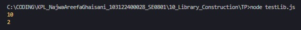

# Tugas Pendahuluan 10: Library Construction

**Nama:** Najwa Areefa Ghaisani  
**NIM:** 103122400028    
**Kelas:** SE-08-01  

## Tugas
Buatlah pustaka JavaScript yang menyediakan utilitas berupa dua fungsi yang menghitung jumlah huruf dan jumlah kata.

Kriteria:
1. Hanya alfabet A hingga Z yang dihitung (besar dan kecil)
2. Spasi tidak dihitung
3. Pustaka bisa diimpor

## Kode Sumber
Tersedia di [index.js](./index.js) dan [testLib.js](./testLib.js)

## Output

 

## Deskripsi Program
Pustaka JavaScript ini aku buat sebagai utility simpel buat ngolah teks, isinya ada dua fungsi utama yaitu hitungHuruf sama hitungKata. Fokus utamanya itu cuma buat ngitung alfabet aja, jadi di fungsi hitungHuruf aku pake regex supaya karakter kayak angka atau simbol nggak bakal ikut kehitung. Terus buat hitungKata, sistemnya bakal mecah kalimat berdasarkan spasi, tapi tetep aman karena udah aku kasih pengecekan biar spasi kosong nggak dianggap kata. Karena udah pake format modul (export), pustaka ini bisa langsung di-impor dan dipake di file lain sesuai kebutuhan proyek.