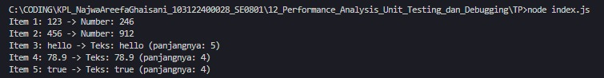

# Tugas Pendahuluan 12: Performance Analysis Unit Testing dan Debungging

**Nama:** Najwa Areefa Ghaisani  
**NIM:** 103122400028    
**Kelas:** SE-08-01  

## Tugas
Cobalah untuk menangkap kecacatan dalam kode ini
```
function main() {
  const data = [
    "123",
    456,
    "hello",
    78.9,
    true,
  ];

  for (let i = 0; i < data.length; i++) {
    const result = processData(data[i]);
    console.log(`Item ${i + 1}: ${data[i]} -> ${result}`);
  }
}

function processData(data) {
  const str = data.toLowerCase();
  const num = parseInt(str);
  if (!isNaN(num) && str === String(num)) {
    return `Number: ${num * 2}`;
  }
  return `Teks: ${str} (panjangnya: ${str.length})`;
}

main();

```

## Kode Sumber
Tersedia di [index.js](./index.js)

## Output

 

## Deskripsi Program
Kode ini adalah solusi buat benerin bug di kode aslinya dengan nambahin `.toString() `sebelum fungsi `.toLowerCase()`. Di kode yang lama, programnya bakal langsung error dan mogok pas ketemu data yang bukan teks kayak angka 456, 78.9, atau boolean true, karena `.toLowerCase()` itu cuma bisa jalan di tipe data string. Sekarang, karena semua jenis datanya udah aku ubah dulu jadi string pakai `data.toString()`, kodenya jadi aman, anti-error, dan bisa ngeproses semua isi arraynya dengan baik